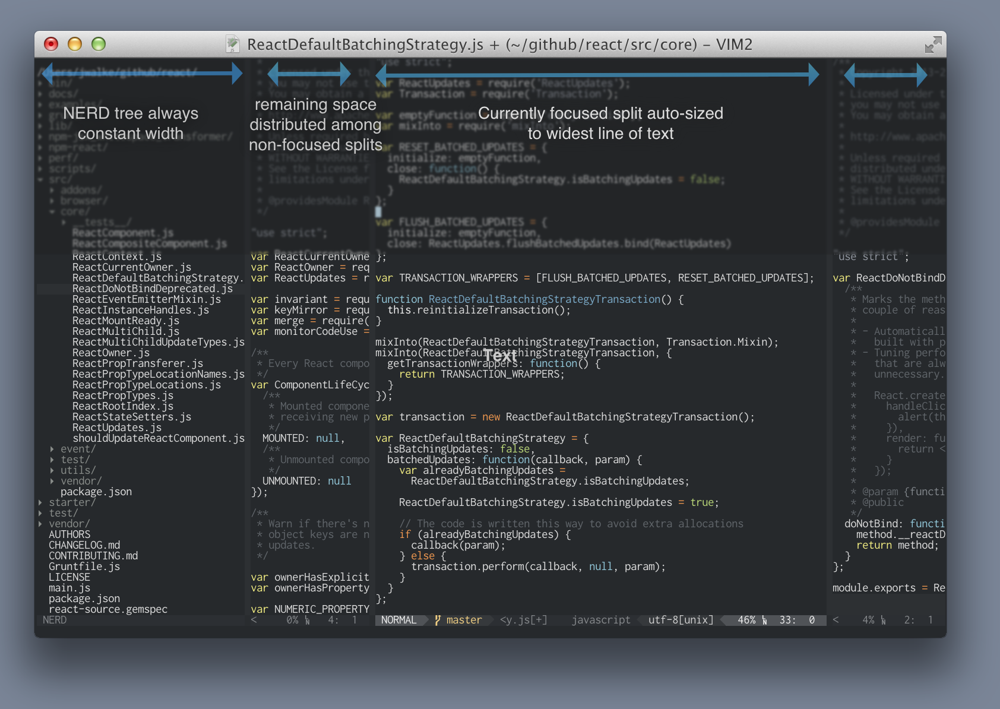

VimSplitBalancer
================
Distributes available space among vertical splits, and plays nice with NERDTree.

`VimSplitBalancer` helps you make optimal use of your screen real estate. Code is usually best viewed in vertical columns since this arrangement helps reduce mental context switching. `VimSplitBalancer` helps you maintain several vertical columns, automatically making the best use of the screen estate by dividing up excess room among vertical splits that aren't focused. The currently focused vertical split will become the width of the widest line in that vertical split.

**Installation**

- install using `Vundle` or `NeoBundle`.

        " Using Vundle
        Bundle 'jordwalke/VimSplitBalancer'

        " Or if using NeoBundle(recommended)
        NeoBundle 'jordwalke/VimSplitBalancer'

LICENSE: MIT unless otherwise noted.
